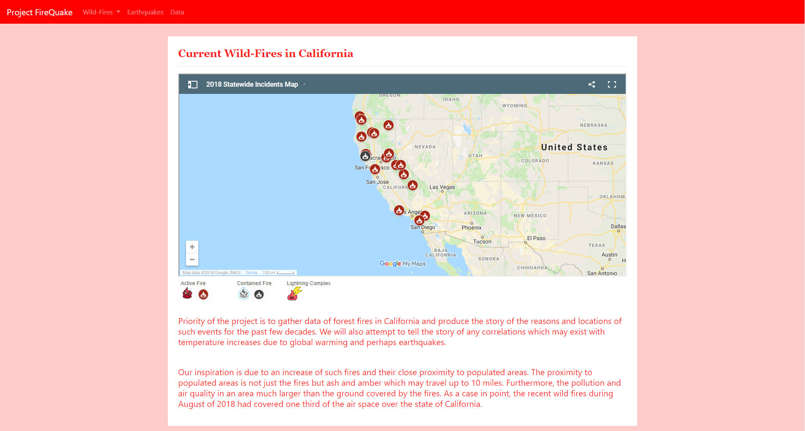
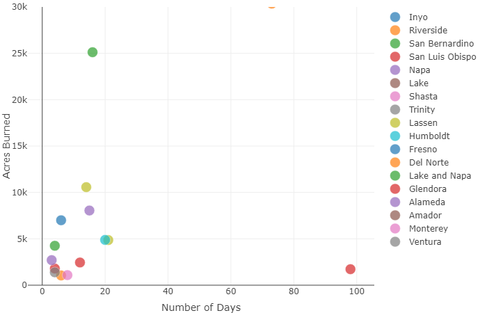
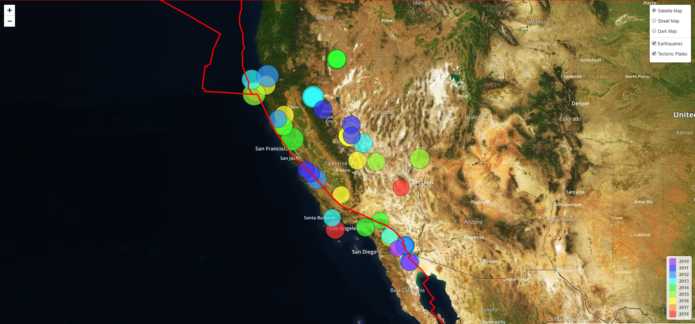
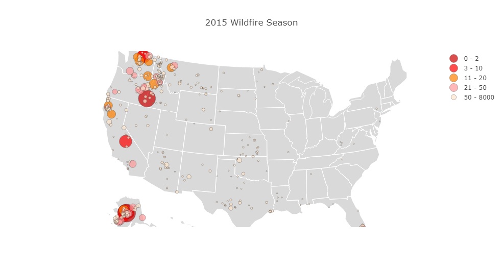

# FireqQuake

## Observation of California wildfires and earthquakes in the last 28 years

Priority of the project is to gather data of forest fires in California and produce the story of the reasons and locations of such events for the past few decades. We will also attempt to tell the story of any correlations which may exist with temperature increases due to global warming and perhaps earthquakes.

Our inspiration is due to an increase of such fires and their close proximity to populated areas. The proximity to populated areas is not just the fires but ash and amber which may travel up to 10 miles. Furthermore, the pollution and air quality in an area much larger than the ground covered by the fires. As a case in point, the recent wild fires during August of 2018 had covered one third of the air space over the state of California.

## Dash D3 Responsive Graph - Burned Areas In California Counties

## Leatlet GeoMap - Earthquakes in California

## Plotly Graph - United States Wilf Fires Per State

